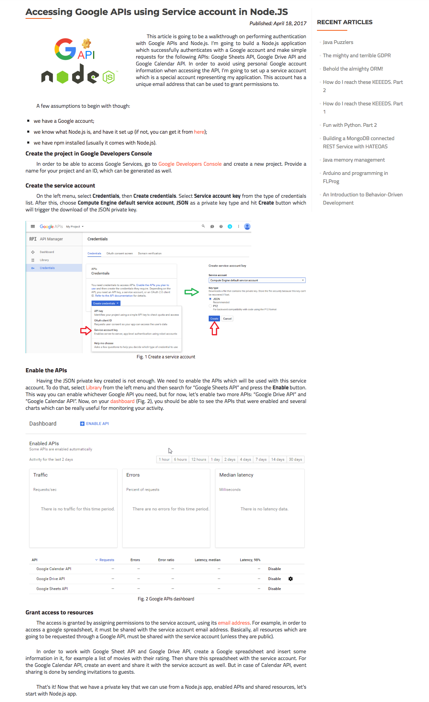

# g-sheets

1. Go here: https://console.developers.google.com/
2. Click credentials
3. Create credentials button
4. Service Account Key
5. Choose existing or create new service account
6. Choose role: Project -> owner
7. Choose JSON
8. Click Create
9. Then library on the side panel
10. Search for Google Spreadsheet api and enable it
11. find service account email address in downloaded json, and share your spreadsheet with it

